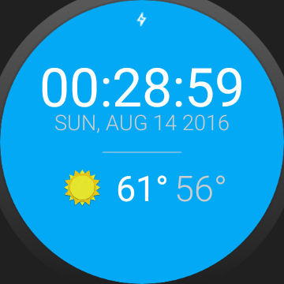
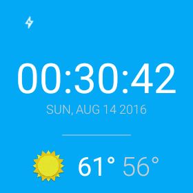

# GoUbiquitous
In this app, I developed a custom watch face to run on an Android Wear device for an exisiting weather app called Sunshine. The Sunshine git repository can be found [here].

In this app, I :   
* Applied the fundamentals of Android wear
* Designed for multiple watch form factors
* Established communication between a mobile device and a wearable device

-Round face  
  

-Square face  

[here]: <https://github.com/udacity/Advanced_Android_Development/tree/7.05_Pretty_Wallpaper_Time>
